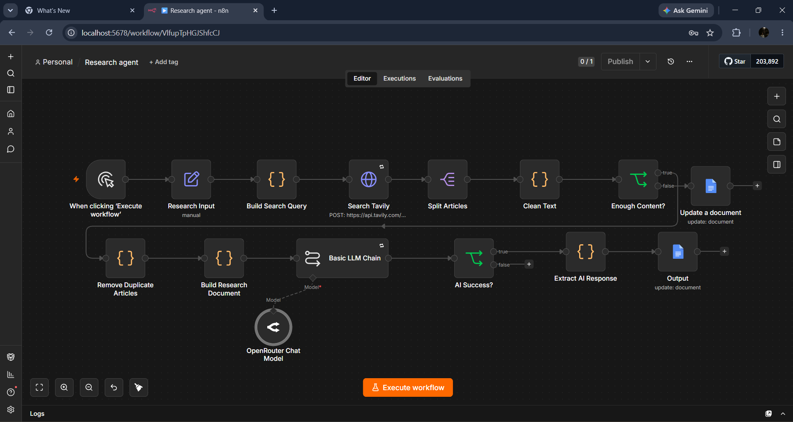

# AI-Research-Automation-Agent
An AI-powered research automation workflow built with n8n, Tavily AI, and OpenRouter.
# AI Research Automation Agent

An AI-powered research automation workflow built with **n8n**, **Tavily AI**, and **OpenRouter**.

## Overview

This workflow automates the research process by:

- Searching the web for a given topic
- Collecting relevant articles
- Cleaning noisy content
- Removing duplicate results
- Building a structured research document
- Sending it to an LLM
- Generating a Markdown research report

## Features

- Tavily Search API
- OpenRouter LLM
- Content Cleaning
- Duplicate Removal
- Retry Handling
- Markdown Report Generation
- Runs locally with Docker
- Uses free APIs and free AI models

## Workflow

---

## Architecture

Research Topic

↓

Tavily Search API

↓

Content Cleaning

↓

Duplicate Removal

↓

Research Builder

↓

OpenRouter LLM

↓

Markdown Report

## Tech Stack

- n8n
- Tavily API
- OpenRouter
- JavaScript
- Docker

## Repository Contents

- AI-Research-Automation-Agent.json
- sample-report.md
- screenshots/

## Future Improvements

- PDF Export
- Multi-model fallback
- Better logging
- Source credibility scoring
- Dynamic topic input

## Author

Venkat Krishnan
